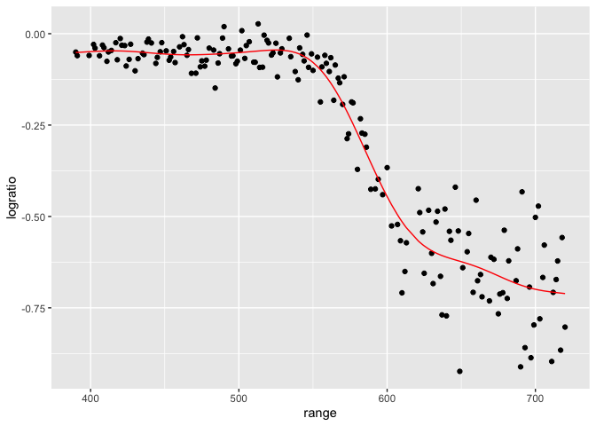
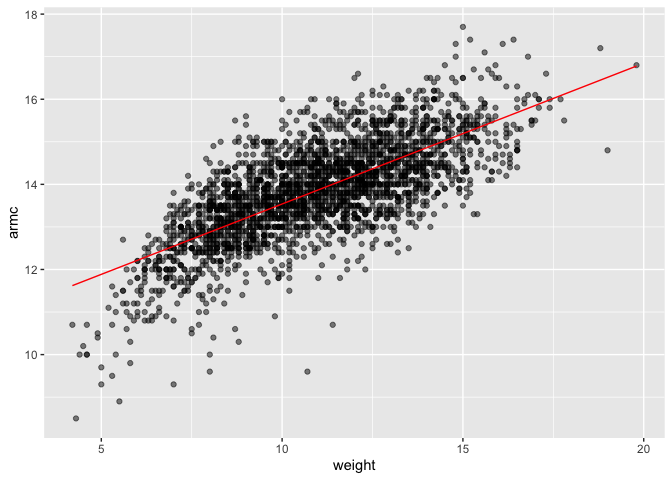
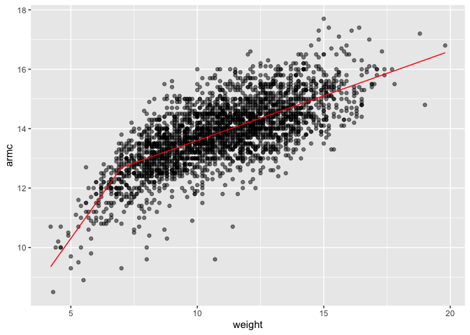

Cross Validation
================

## Cross validation

Take 80% of data to train and 20% to test. Test multiple models on the
same split (training and testing), find RMSE –\> Move on to the next
split. - Can use to compare candidate models that are all
“traditional” - Comes up a lot in modern methods - Automated varaible
selection (e.g lass0) - Additive models - Regression trees \##
Refinement and variations Can also create 5 random groups - test models
for each group Folding (5-fold, 10-fold, LOOCV) partitions data into
equally-sized subsets - One fold is used as testing, with the remaining
folds as training - Repeated for each fold as testing

## Prediction as a goal

- Cross validation is about prediction
- Prediction accuracy matters
  - Different goal than statistical signfiicance
  - Models that make poor predictions probably don’t adequately describe
    the data generating mechanism

## Tools for CV

- `add_predictions()` and `add_residuals()`
- `rmse()`
- `crossv_mc()`

``` r
library(tidyverse)
```

    ## ── Attaching core tidyverse packages ──────────────────────── tidyverse 2.0.0 ──
    ## ✔ dplyr     1.1.4     ✔ readr     2.1.5
    ## ✔ forcats   1.0.0     ✔ stringr   1.5.1
    ## ✔ ggplot2   3.5.1     ✔ tibble    3.2.1
    ## ✔ lubridate 1.9.3     ✔ tidyr     1.3.1
    ## ✔ purrr     1.0.2     
    ## ── Conflicts ────────────────────────────────────────── tidyverse_conflicts() ──
    ## ✖ dplyr::filter() masks stats::filter()
    ## ✖ dplyr::lag()    masks stats::lag()
    ## ℹ Use the conflicted package (<http://conflicted.r-lib.org/>) to force all conflicts to become errors

``` r
library(modelr)
library(mgcv)
```

    ## Loading required package: nlme
    ## 
    ## Attaching package: 'nlme'
    ## 
    ## The following object is masked from 'package:dplyr':
    ## 
    ##     collapse
    ## 
    ## This is mgcv 1.9-1. For overview type 'help("mgcv-package")'.

``` r
library(SemiPar)

set.seed(1)
```

Look at LIDAR data

``` r
data("lidar")

lidar_df = 
  lidar |> 
  as_tibble() |> 
  mutate(
    id = row_number()
  )
```

``` r
lidar_df |> 
  ggplot(aes(x = range, y = logratio)) +
  geom_point()
```

<!-- -->

## Try to do CV

We’ll compare 3 models – one linear, one smooth, one wiggly

Construct training and testing dfs

``` r
train_df = sample_frac(lidar_df, size = 0.8)
test_df = anti_join(lidar_df, train_df, by = "id")
```

Look at these. Black = training data. Red = testing data.

``` r
ggplot(train_df, aes(x = range, y = logratio)) +
  geom_point() +
  geom_point(data = test_df, color = "red")
```

<!-- -->

Fit three models. gam() would give you a smooth fit. s(range) is
analogous to using polynomials but polynomials are numerically.
Collection of smooth function that captures non-linearity.

s(range, k = 30) uses more functions than default. sp = 10e-6 (smoothing
parameter) is set arbitrarily small which will overfit

``` r
linear_model = lm(logratio ~ range, data = train_df)

smooth_model = gam(logratio ~ s(range), data = train_df)

wiggly_model = gam(logratio ~ s(range, k = 30), sp = 10e-6, data = train_df)
```

Look at fits

Linear model doesn’t entirely capture the trend. RMSE is very large.

``` r
train_df |> 
  add_predictions(linear_model) |> 
  ggplot(aes(x = range, y = logratio)) +
  geom_point() +
  geom_point(data = test_df, color = "red")+
  geom_line(aes(y = pred), color = "red")
```

<!-- -->

Wiggly model is trying too hard to follow the dataset. This is
overfitting.

``` r
train_df |> 
  add_predictions(wiggly_model) |> 
  ggplot(aes(x = range, y = logratio)) +
  geom_point() +
  geom_line(aes(y = pred), color = "red")
```

<!-- -->

This model is just right. Not doing too much but better than the linear
model as it captures the trend in the dataset. Flexible model structure
but not too flexible.

``` r
train_df |> 
  add_predictions(smooth_model) |> 
  ggplot(aes(x = range, y = logratio)) +
  geom_point() +
  geom_line(aes(y = pred), color = "red")
```

<!-- -->

Compare these numerically using RMSE. RMSE for linear is highest,
followed by wiggly then smooth. Wiggly is just slightly higher in RMSE
compared to smooth.

``` r
rmse(linear_model, test_df)
```

    ## [1] 0.127317

``` r
rmse(wiggly_model, test_df)
```

    ## [1] 0.08848557

``` r
rmse(smooth_model, test_df)
```

    ## [1] 0.08302008

## Repeat the train / test split

Is this difference in RMSE between wiggly and smooth consistent?

``` r
cv_df = 
  crossv_mc(lidar_df, 100) |> 
  mutate(
    train = map(train, as_tibble),
    test = map(test, as_tibble)
  )
```

Fit linear models to all 100 training datasets. Extract RMSE. DO the
same thing for swiggly and smooth models

``` r
cv_res_df = 
  cv_df |> 
  mutate(
    linear_model = map(train, \(x) lm(logratio ~ range, data = x)),
    smooth_model = map(train, \(x) gam(logratio ~ s(range), data = x)),
    swiggly_model = map(train, \(x) gam(logratio ~ s(range, k = 30), sp = 10e-6, data = x))
  ) |> 
  mutate(
    rmse_linear = map2_dbl(linear_model, test, rmse),
    rmse_smooth = map2_dbl(smooth_model, test, rmse),
    rmse_swiggly = map2_dbl(swiggly_model, test, rmse)
  )
```

Look at RMSE distribution

``` r
cv_res_df |> 
  select(starts_with("rmse")) |> 
  pivot_longer(
    everything(),
    names_to = "model",
    values_to = "rmse",
    names_prefix = ("rmse_")
  ) |> 
  ggplot(aes(x = model, y = rmse)) +
  geom_violin()
```

<!-- -->

## Nepalese children Df

``` r
child_df =
  read_csv("data/nepalese_children.csv") |> 
  mutate(
    weight_ch7 = (weight > 7) *(weight -7) #when weight is less than 7, set it equal to 0
  )
```

    ## Rows: 2705 Columns: 5
    ## ── Column specification ────────────────────────────────────────────────────────
    ## Delimiter: ","
    ## dbl (5): age, sex, weight, height, armc
    ## 
    ## ℹ Use `spec()` to retrieve the full column specification for this data.
    ## ℹ Specify the column types or set `show_col_types = FALSE` to quiet this message.

Look at data

``` r
child_df |> 
  ggplot(aes(x = weight, y = armc)) +
  geom_point(alpha = .5)
```

<!-- -->

Fit some models

``` r
linear_model = lm(armc ~ weight, data = child_df)
pwl_model = lm(armc ~ weight + weight_ch7, data = child_df)
smooth_model = gam(armc ~ s(weight), data = child_df)
```

Look at models Linear model looks ok but not capturing the head and tail
part of the data.

``` r
child_df |>  
  add_predictions(linear_model) |> 
  ggplot(aes(x = weight, y = armc)) +
  geom_point(alpha = 0.5) +
  geom_line(aes(y = pred), color = "red")
```

<!-- -->

Piece wise model - changes slope at weight = 7

``` r
child_df |>  
  add_predictions(pwl_model) |> 
  ggplot(aes(x = weight, y = armc)) +
  geom_point(alpha = 0.5) +
  geom_line(aes(y = pred), color = "red")
```

<!-- -->

Smooth model. You can’t tell the correlation coefficient from a

``` r
child_df |>  
  add_predictions(smooth_model) |> 
  ggplot(aes(x = weight, y = armc)) +
  geom_point(alpha = 0.5) +
  geom_line(aes(y = pred), color = "red")
```

<!-- -->

CV to select models

``` r
cv_df =
  crossv_mc(child_df, 100) |> 
  mutate(
    train = map(train, as_tibble),
    test = map(test, as_tibble)
  ) 
```

Apply models to extract RMSE

``` r
cv_res_df =
  cv_df |> 
  mutate(
    linear_model = map(train, \(x) lm(armc ~ weight, data = x)),
    pwl_model = map(train, \(x) lm(armc ~ weight + weight_ch7, data = x)),
    smooth_model = map(train, \(x) gam(armc ~ s(weight), data = x))
  ) |> 
  mutate(
    rmse_linear = map2_dbl(linear_model, test, rmse),
    rmse_pwl = map2_dbl(pwl_model, test, rmse),
    rmse_smooth = map2_dbl(smooth_model, test, rmse)
  )
```

``` r
cv_res_df |> 
  select(starts_with("rmse")) |> 
  pivot_longer(
    everything(),
    names_to = "model",
    values_to = "rmse",
    names_prefix = ("rmse_")
  ) |> 
  ggplot(aes(x = model, y = rmse)) +
  geom_violin()
```

<!-- -->
