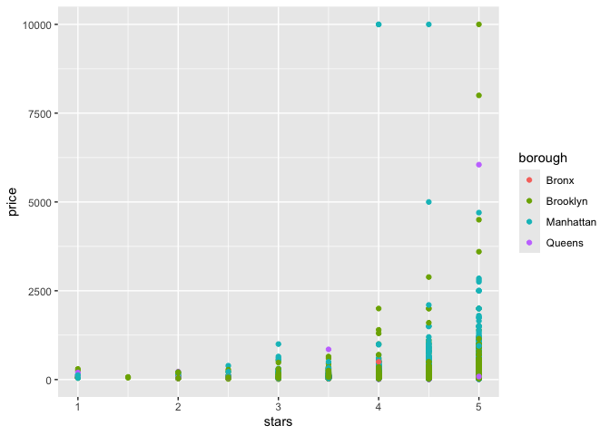
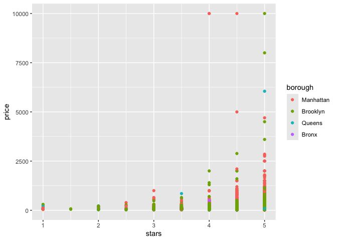
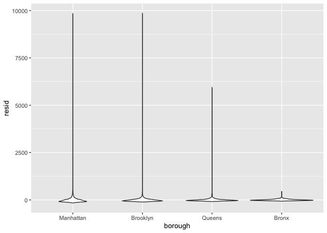
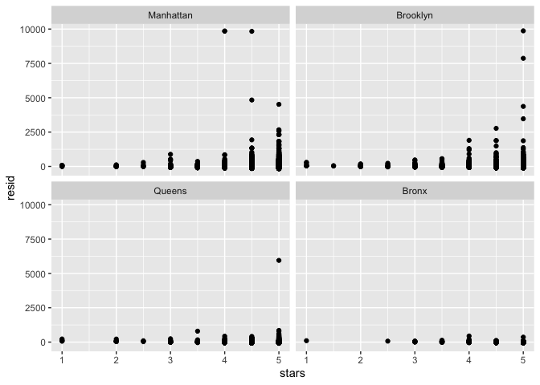
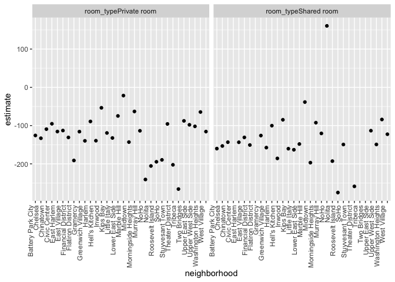

Linear Regression
================
My An Huynh
2024-11-07

## Linear models

y = beta0 + beta1x1 + … + betapxip + ei,ei ~ (0,sigma^2)

Preictors: Outcome is continuous; predictors can be anything Continuous
predictors are added directly Categorical predictors require dummy
indicator variables - For each non-reference group, a binary(0/1)
variable indicating group membership for each subject is created and
used in the model.

Testing - For a single regression coefficient, you can construct a test
statistic using t = (beta_hat - beta) / SE(beta) where beta is the null
and beta_hat is the estimate. For large samples, this has a standard
normal distribution. To test multiple coefficients (i.e those arising
from the inclusion of a categorical variable with several predictors)
but can use an F-test / ANOVA.

Diagnostics - Many model assumptions (constant variance, model
specification) can be examined using residuals - Look at overall
distribution (centered at 0? skewed?) - Look at residuals vs predictors
(any non-linearity? trends? non-constant residual variance?) - Are there
structures in residuals? Have you fit the right trendline? Is there low
variance vs high variance on different sides of the fit? - Departures
from these assumptions means that the statistical tests you have done
then downstream things/results are also not right.

Linear models in R - lm for linear models - glm for generalized linear
models

Arguments include - formula: y (output) ~ x1 + x2 (list of predictors) -
data

Output is complex –\> Use broom

``` r
library(tidyverse)
```

    ## ── Attaching core tidyverse packages ──────────────────────── tidyverse 2.0.0 ──
    ## ✔ dplyr     1.1.4     ✔ readr     2.1.5
    ## ✔ forcats   1.0.0     ✔ stringr   1.5.1
    ## ✔ ggplot2   3.5.1     ✔ tibble    3.2.1
    ## ✔ lubridate 1.9.3     ✔ tidyr     1.3.1
    ## ✔ purrr     1.0.2     
    ## ── Conflicts ────────────────────────────────────────── tidyverse_conflicts() ──
    ## ✖ dplyr::filter() masks stats::filter()
    ## ✖ dplyr::lag()    masks stats::lag()
    ## ℹ Use the conflicted package (<http://conflicted.r-lib.org/>) to force all conflicts to become errors

``` r
library(p8105.datasets)
```

``` r
data("nyc_airbnb")

nyc_airbnb  = 
  nyc_airbnb |> 
  mutate(stars = review_scores_location / 2) |> 
  rename(
    borough = neighbourhood_group,
    neighborhood = neighbourhood
  ) |> 
  filter(borough != "Staten Island") |> 
  select(price, stars, borough, neighborhood, room_type)
```

# Fit a model

``` r
nyc_airbnb |> 
  ggplot(aes(x = stars, y = price, color = borough)) +
  geom_point()
```

    ## Warning: Removed 9962 rows containing missing values or values outside the scale range
    ## (`geom_point()`).

<!-- -->

Let’s fit a model we care about. Fit price against stars and borough

``` r
fit = lm(price ~ stars + borough, data = nyc_airbnb)
```

Let’s look at the result

``` r
fit
summary(fit)
summary(fit)$coef
coef(fit)
```

Let’s look at the result better broom::glance() gives you some of the
more useful stats in a tibble broom::tidy() gives a whole df. stars is
the reference group. For every 1 unit increase in stars (implicit
neighborhood = the bronx), we expect the price of the room to go up 32
dollars keep the borough fixed.

``` r
broom::glance(fit)
```

    ## # A tibble: 1 × 12
    ##   r.squared adj.r.squared sigma statistic   p.value    df   logLik    AIC    BIC
    ##       <dbl>         <dbl> <dbl>     <dbl>     <dbl> <dbl>    <dbl>  <dbl>  <dbl>
    ## 1    0.0342        0.0341  182.      271. 6.73e-229     4 -202113. 4.04e5 4.04e5
    ## # ℹ 3 more variables: deviance <dbl>, df.residual <int>, nobs <int>

``` r
broom::tidy(fit) |> 
  select(-std.error, -statistic) |> 
  mutate(
    term = str_replace(term, "borough", "Borough: ")
  ) |> 
  knitr::kable(digits = 3)
```

| term               | estimate | p.value |
|:-------------------|---------:|--------:|
| (Intercept)        |  -70.414 |   0.000 |
| stars              |   31.990 |   0.000 |
| Borough: Brooklyn  |   40.500 |   0.000 |
| Borough: Manhattan |   90.254 |   0.000 |
| Borough: Queens    |   13.206 |   0.145 |

## Be in control of factors

Factor borough and room type based on frequency

``` r
nyc_airbnb = 
  nyc_airbnb |> 
  mutate(
    borough = fct_infreq(borough),
    room_type = fct_infreq(room_type)
  )
```

Make a plot. Now the x-axis is ordered by the frequency

``` r
nyc_airbnb |> 
  ggplot(aes(x = stars, y = price, color = borough)) +
  geom_point()
```

    ## Warning: Removed 9962 rows containing missing values or values outside the scale range
    ## (`geom_point()`).

<!-- -->

Refit model. Now the reference group is Manhattan. It hasn’t
substantially changed what is happening.

``` r
fit = lm(price ~ stars + borough, data = nyc_airbnb)

broom::tidy(fit)
```

    ## # A tibble: 5 × 5
    ##   term            estimate std.error statistic   p.value
    ##   <chr>              <dbl>     <dbl>     <dbl>     <dbl>
    ## 1 (Intercept)         19.8     12.2       1.63 1.04e-  1
    ## 2 stars               32.0      2.53     12.7  1.27e- 36
    ## 3 boroughBrooklyn    -49.8      2.23    -22.3  6.32e-109
    ## 4 boroughQueens      -77.0      3.73    -20.7  2.58e- 94
    ## 5 boroughBronx       -90.3      8.57    -10.5  6.64e- 26

## Diagnostics

Use modelr to add a column for the residuals Distribution of residuals
for each neighborhood. It looks like the distribution of residuals is
quite skewed. We’ve got outliers.

Queens has 1 outlier.

``` r
nyc_airbnb |> 
  modelr::add_residuals(fit) |> 
  ggplot(aes(x = borough, y = resid)) +
  geom_violin() 
```

    ## Warning: Removed 9962 rows containing non-finite outside the scale range
    ## (`stat_ydensity()`).

<!-- -->

``` r
nyc_airbnb |> 
  modelr::add_residuals(fit) |> 
  ggplot(aes(x = stars, y = resid)) +
  geom_point() +
  facet_wrap(. ~ borough)
```

    ## Warning: Removed 9962 rows containing missing values or values outside the scale range
    ## (`geom_point()`).

<!-- -->

# Hypothesis tests

Ask whether the predicotr as a whole is signfiicant in the context of
the model?

``` r
fit |> 
  broom::tidy()
```

    ## # A tibble: 5 × 5
    ##   term            estimate std.error statistic   p.value
    ##   <chr>              <dbl>     <dbl>     <dbl>     <dbl>
    ## 1 (Intercept)         19.8     12.2       1.63 1.04e-  1
    ## 2 stars               32.0      2.53     12.7  1.27e- 36
    ## 3 boroughBrooklyn    -49.8      2.23    -22.3  6.32e-109
    ## 4 boroughQueens      -77.0      3.73    -20.7  2.58e- 94
    ## 5 boroughBronx       -90.3      8.57    -10.5  6.64e- 26

What about the significance of `borough`? Do f-test or ANOVA

``` r
fit_null = lm(price ~ stars, data = nyc_airbnb)
fit_alt = lm(price ~ stars + borough, data = nyc_airbnb)

anova(fit_null, fit_alt) |> 
  broom::tidy()
```

    ## # A tibble: 2 × 7
    ##   term                    df.residual     rss    df   sumsq statistic    p.value
    ##   <chr>                         <dbl>   <dbl> <dbl>   <dbl>     <dbl>      <dbl>
    ## 1 price ~ stars                 30528  1.03e9    NA NA            NA  NA        
    ## 2 price ~ stars + borough       30525  1.01e9     3  2.53e7      256.  7.84e-164

## Nest data, fit models

Is there an association by stars and price and does it vary by borough?
What about room_type? Does room type have a bigger effect in one borough
compared to others?

Fit an interaction.

This is pretty formal and more complex

``` r
fit = 
  lm(price ~ stars * borough + room_type * borough, data = nyc_airbnb) |> 
  broom::tidy()
```

This is exploratory but maybe easier to understand. Nesting makes it
easier to understand

``` r
nyc_airbnb |> 
  nest(data = -borough) |> 
  mutate(
    models = map(.x = data, ~lm(price ~ stars + room_type, data = .x)),
    results = map(models, broom::tidy)
  ) |>
  select(-data, -models) |> 
  unnest(results) |> 
  filter(term != "(Intercept") |> 
  select(borough, term, estimate) |> 
  pivot_wider(
    names_from = borough,
    values_from = estimate
  )
```

    ## # A tibble: 4 × 5
    ##   term                   Bronx Queens Brooklyn Manhattan
    ##   <chr>                  <dbl>  <dbl>    <dbl>     <dbl>
    ## 1 (Intercept)            90.1   91.6      69.6      95.7
    ## 2 stars                   4.45   9.65     21.0      27.1
    ## 3 room_typePrivate room -52.9  -69.3     -92.2    -124. 
    ## 4 room_typeShared room  -70.5  -95.0    -106.     -154.

More nesting. If you want to look at room type and stars in the context
of neighborhood in manhattan. Nest everything but neighborhood. You get
a listcol of other variables.

``` r
nyc_airbnb |> 
  filter(borough == "Manhattan") |> 
  nest(data = -neighborhood) |> 
  mutate(
    models = map(.x = data, ~lm(price ~ stars + room_type, data = .x)),
    results = map(models, broom::tidy)
  ) |>
  select(-data, -models) |> 
  unnest(results) |> 
  filter(str_detect(term, "room_type")) |> 
  ggplot(aes(x = neighborhood, y = estimate)) +
  geom_point() +
  facet_wrap(. ~ term) +
  theme(axis.text.x = element_text(angle = 90, vjust = -0.5, hjust = 1))
```

<!-- -->

If we’re keep stars fixed, you’re saving x amounts of money if you stay
in a private/shared room compared to an entire apartment.
